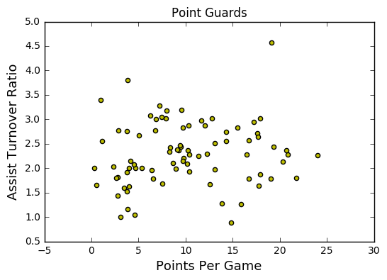
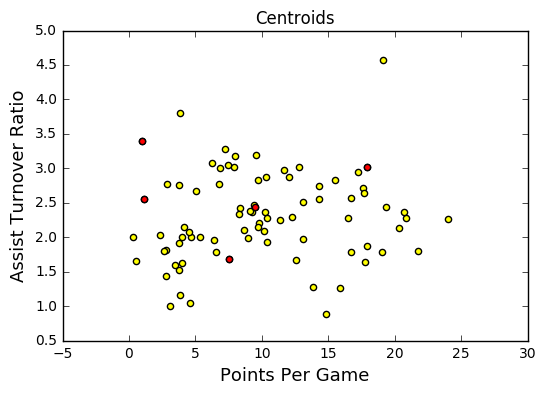
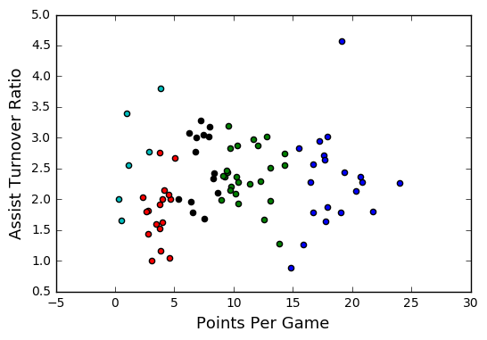

```python
import pandas as pd
import numpy as np
import math
import matplotlib.pyplot as plt

nba = pd.read_csv("D:\\test\\machineLearning\\nba_2013.csv")
print nba.head(3)
```

             player pos  age bref_team_id   g  gs    mp   fg  fga    fg.  \
    0    Quincy Acy  SF   23          TOT  63   0   847   66  141  0.468   
    1  Steven Adams   C   20          OKC  81  20  1197   93  185  0.503   
    2   Jeff Adrien  PF   27          TOT  53  12   961  143  275  0.520   
    
          ...      drb  trb  ast  stl  blk  tov   pf  pts     season  season_end  
    0     ...      144  216   28   23   26   30  122  171  2013-2014        2013  
    1     ...      190  332   43   40   57   71  203  265  2013-2014        2013  
    2     ...      204  306   38   24   36   39  108  362  2013-2014        2013  
    
    [3 rows x 31 columns]
    


```python
#取出后卫的数据
point_guards = nba[nba["pos"]=="PG"]
#pts代表是总得分，g代表是打了多少场球
point_guards["ppg"] = point_guards['pts']/point_guards['g']
point_guards[['pts','g','ppg']].head(5)
```

    C:\Users\qiujiahao\Anaconda2\lib\site-packages\ipykernel\__main__.py:4: SettingWithCopyWarning: 
    A value is trying to be set on a copy of a slice from a DataFrame.
    Try using .loc[row_indexer,col_indexer] = value instead
    
    See the caveats in the documentation: http://pandas.pydata.org/pandas-docs/stable/indexing.html#indexing-view-versus-copy
    


<div>
<table border="1" class="dataframe">
  <thead>
    <tr style="text-align: right;">
      <th></th>
      <th>pts</th>
      <th>g</th>
      <th>ppg</th>
    </tr>
  </thead>
  <tbody>
    <tr>
      <th>24</th>
      <td>930</td>
      <td>71</td>
      <td>13.098592</td>
    </tr>
    <tr>
      <th>29</th>
      <td>150</td>
      <td>20</td>
      <td>7.500000</td>
    </tr>
    <tr>
      <th>30</th>
      <td>660</td>
      <td>79</td>
      <td>8.354430</td>
    </tr>
    <tr>
      <th>38</th>
      <td>666</td>
      <td>72</td>
      <td>9.250000</td>
    </tr>
    <tr>
      <th>50</th>
      <td>378</td>
      <td>55</td>
      <td>6.872727</td>
    </tr>
  </tbody>
</table>
</div>


```python
#tov代表失误的次数,ast代表助攻的次数
point_guards=point_guards[point_guards['tov']!=0]
point_guards['atr'] = point_guards['ast']/point_guards['tov']
```


```python
plt.scatter(point_guards['ppg'],point_guards['atr'],c='y')
plt.title("Point Guards")
plt.xlabel("Points Per Game",fontsize=13)
plt.ylabel("Assist Turnover Ratio",fontsize=13)
plt.show()
```





```python
#使用K-means聚类时，
#第一步：当k=5时，他会随机选取5个点作为中心点，然后计算所有点到这5个点的距离
#第二步：将每一个点划到不同的簇
#第三步：将每一个簇中的点计算横纵坐标的均值，计算出新的中心点(可以是不是实际的点)
#第四步：重新计算每一个点到中心点的距离，重新划分属于不同的簇
#第五步：不断的更新中心点，不断的重新划分簇，直到再怎么更新中心点，簇里的元素都不再发生变化了
num_clusters=5
#随机的选出5个点
random_initial_points=np.random.choice(point_guards.index,size=num_clusters)
#选出中心点
centroids = point_guards.loc[random_initial_points]
```


```python
#红色的即为初始化后的中心点
plt.scatter(point_guards['ppg'],point_guards['atr'],c='yellow')
plt.scatter(centroids['ppg'],centroids['atr'],c='red')
plt.title("Centroids")
plt.xlabel('Points Per Game',fontsize=13)
plt.ylabel('Assist Turnover Ratio',fontsize=13)
plt.show()
```





```python
#将中心点的信息保存再字典里
def centroids_to_dict(centroids):
    dictionary = dict()
    counter = 0
    #iterrows代表逐行遍历
    for index,row in centroids.iterrows():
        coordinates = [row['ppg'],row['atr']]
        dictionary[counter]=coordinates
        counter += 1
        
    return dictionary 

centroids_dict = centroids_to_dict(centroids)
print centroids_dict
```

    {0: [7.5, 1.6842105263157894], 1: [17.936708860759495, 3.020618556701031], 2: [9.5, 2.43609022556391], 3: [1.125, 2.5555555555555554], 4: [1.0, 3.4]}
    


```python
#计算距离的公式
def calculate_distance(centroid,player_values):
    root_distance=0
    
    for x in range(0,len(centroid)):
        difference = centroid[x]-player_values[x]
        squared_difference = difference**2
        root_distance += squared_difference
    
    euclid_distance = math.sqrt(root_distance)
    return euclid_distance

q = [5,2]
p = [3,1]
print (calculate_distance(q,p))
```

    2.2360679775
    


```python
#对所有数据选择自己的中心点,进行分类
def assign_to_cluster(row):
    lowest_distance=-1
    closest_cluster=-1
    euclidean_distance=-1
    
    #对每行的数据进行比较，得出这一行数据最近的中心点，属于这一簇
    for cluster_id,centroid in centroids_dict.items():
        df_row = [row['ppg'],row['atr']]
        euclidean_distance = calculate_distance(centroid,df_row)
        if lowest_distance == -1:
            lowest_distance = euclidean_distance
            closest_cluster = cluster_id
        elif euclidean_distance < lowest_distance:
            lowest_distance = euclidean_distance
            closest_cluster = cluster_id
    return closest_cluster

point_guards['cluster'] = point_guards.apply(lambda row:assign_to_cluster(row),axis=1)
```


```python
#将结果显示出来
def visualize_clusters(df,num_clusters):
    colors = ['b','g','r','c','m','y','k']
    
    for n in range(num_clusters):
        clustered_df = df[df['cluster'] == n]
        plt.scatter(clustered_df['ppg'],clustered_df['atr'],c=colors[n-1])
        plt.xlabel('Points Per Game',fontsize=13)
        plt.ylabel('Assist Turnover Ratio',fontsize=13)
    
    plt.show()
    
#将分类的数据显示出来    
visualize_clusters(point_guards,5)
```


```python
#重新计算中心点
def recalculate_centroids(df):
    new_centroids_dict = dict()
    #0..1..2..3..4
    for cluster_id in range(0,num_clusters):
        #取出每一中类型的所有点
        class_all=df[df['cluster']==cluster_id]
        mean_ppg = class_all['ppg'].mean()
        mean_atr = class_all['atr'].mean()
        new_centroids_dict[cluster_id]= [mean_ppg,mean_atr]
    return new_centroids_dict
```


```python
#重新计算中心点
centroids_dict = recalculate_centroids(point_guards)
#对所有点进行重新划分中心点
point_guards["cluster"] = point_guards.apply(lambda row:assign_to_cluster(row),axis=1)
#将分类的数据显示出来    
visualize_clusters(point_guards,5)
```





```python
#以上代码是自己实现,以下是利用库函数实现
from sklearn.cluster import KMeans
#调用sklearn的库函数，只需指定需要分类的个数
kmeans = KMeans(n_clusters=num_clusters)
kmeans.fit(point_guards[['ppg','atr']])
point_guards['cluster'] = kmeans.labels_
visualize_clusters(point_guards,num_clusters)
```


